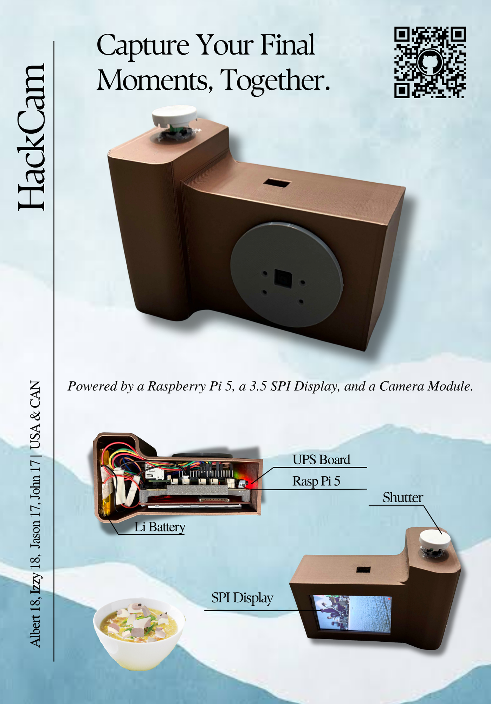

# HackCam
This project is a portable camera built with a Raspberry Pi 5, Raspberry Pi Camera, SPI display, rechargeable LiPo battery, charger board, SD card, and button. The camera is designed to show a live preview on the screen and capture photos when the button is pressed.

## Why We Made It
In the case that the world ends, we need a way to preserve memories for future generations or possibly aliens when they come to Earth. What better way than a camera!

The screen is wired to the Raspberry Pi 5 and the battery is wired to the power management board and will be placed perpendicular. The UPS board, screen, and microcontroller will be all stacked together compactly. The design sketch is pointed out by a red arrow. 

## Materials:
- Raspberry Pi 5 1 GB
- Raspberry Pi Camera
- 3.5 in SPI Module (screen)
- Rasp Pi 5 Camera Module Ribbon
- 3.7 V 5000 mAh battery
- Lipo Charger Board
- SD Card
- Button

## Assembly

## Wiring

## Firmware
Images are displayed on the screen through a python script. Firmware available in Firmware folder. 

## How to Assemble and Setup
1. Flash the Pi 5
2. Wire the screen to the Pi 5 (see schematic)
3. Connect the Camera Module to the Rasp Pi 5
4. Wire the button to the Rasp Pi 5
5. 3D print the casing
6. Screw the UPS board and UPS board together. Screw the screen to the connection piece which the other pieces snap onto.
7. Assemble all the parts inside of the case (see Assembly section)

## Bill of Materials

| Product Name | Quantity | Unit Price | Total Price | Link |
|---|---:|---:|---:|---|
| 3.7V 5000mAh 954390 Lithium Polymer Rechargeable Battery | 1 | $2.90 | $2.90 | https://www.aliexpress.us/item/3256810480119415.html |
| Geekworm X1203 UPS 5.1V 5A Shield & Power Management Board for Raspberry Pi 5 | 1 | $26.49 | $26.49 | https://www.aliexpress.us/item/3256806860277051.html |
| Raspberry Pi 5 | 1 | $96.50 | $96.50 | https://www.aliexpress.us/item/3256811964473748.html |
| Raspberry Pi Camera Module Board REV 1.3 5MP | 1 | $4.14 | $4.14 | https://www.aliexpress.us/item/3256807198247258.html |
| 3.5 inch SPI Serial LCD Module 480×320 TFT ILI9486/ILI9488 | 1 | $2.16 | $2.16 | https://www.aliexpress.us/item/3256804419100652.html |
| Raspberry Pi Camera FFC Ribbon Cable | 1 | $0.99 | $0.99 | https://www.aliexpress.us/item/3256810142755706.html |
| Metal Soft Shutter Release Button | 1 | $0.99 | $0.99 | https://www.aliexpress.us/item/3256805951862321.html |
| TF / MicroSD Memory Card | 1 | $0.99 | $0.99 | https://www.aliexpress.us/item/3256810252980964.html |

**Total Cost:** `$135.16`
